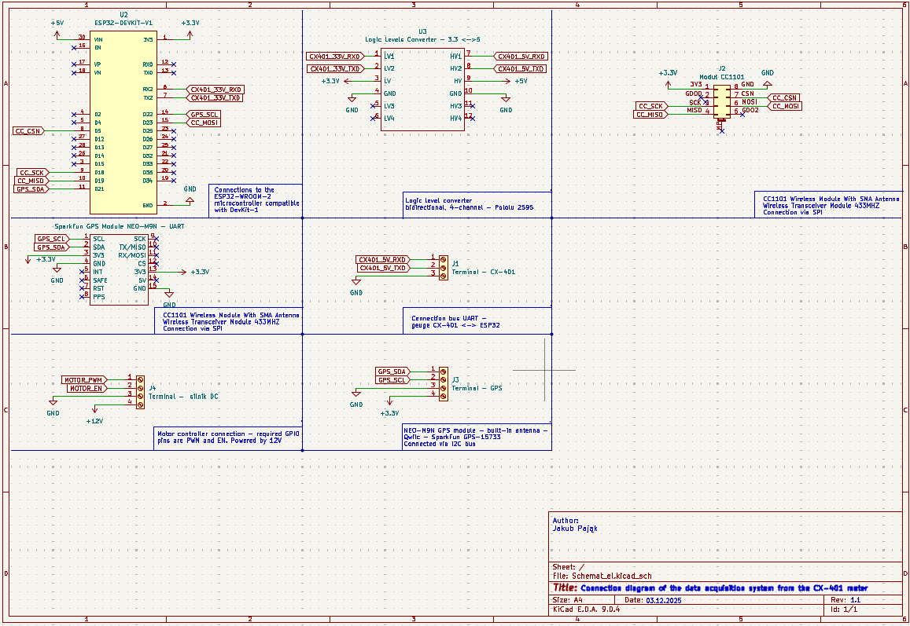

# Dokumentacja Techniczna Systemu Embedded: Jednostka Pomiarowa UAV (ESP32 / GNSS / CX-401 / CC1101)

Niniejsze repozytorium zawiera projekt schematu połączeń, dokumentację sprzętową oraz oprogramowanie dla systemu akwizycji danych środowiskowych (cieku wodnego). System zaprojektowano do integracji z bezzałogowym statkiem powietrznym, a jego głównym zadaniem jest agregacja danych z miernika wielofunkcyjnego Elmetron CX-401, korelacja z danymi pozycyjnymi GNSS, sterowanie układem napędowym zwijarki oraz dwukierunkowa transmisja radiowa w celu komunikacji z naziemną stacją kontroli lotu (GCS).

## Schemat Ideowy

Poniższy rysunek przedstawia schemat połączeń elektrycznych pomiędzy jednostką obliczeniową a peryferiami.

*(Rys. 1. Schemat połączeń modułów w środowisku KiCad – Rewizja 1.1)*

---

## Specyfikacja Sprzętowa

Jednostka centralna oparta jest na mikrokontrolerze ESP32 (DevKit v1), realizującym zadania nadrzędne (Master). Architektura systemu wykorzystuje magistrale cyfrowe UART, I2C oraz SPI do komunikacji z podsystemami.

### Wykaz komponentów (BOM):
1.  **MCU:** ESP32-WROOM-32 (moduł rozwojowy DevKit v1).
2.  **Moduł GNSS:** SparkFun NEO-M9N (u-blox M9 engine).
    * Interfejs: I2C (Qwiic).
3.  **Transceiver Radiowy:** Moduł CC1101 (433 MHz).
    * Interfejs: SPI.
4.  **Instrument pomiarowy:** Elmetron CX-401.
    * Interfejs: RS-232/TTL (5V).
5.  **Układ dopasowujący:** 4-kanałowy, dwukierunkowy konwerter poziomów logicznych (3.3V <-> 5V).
6.  **Interfejs Napędu:** Wyjścia sterujące dla sterownika silnika DC (PWM + Enable).

---

## Konfiguracja Interfejsów i Mapowanie GPIO

Poniższe tabele definiują fizyczne połączenia pomiędzy mikrokontrolerem a peryferiami zgodnie z rewizją 1.1 schematu elektrycznego.

### 1. Interfejs Miernika CX-401 (UART2)
Ze względu na różnicę napięć logicznych (ESP32: 3.3V, CX-401: 5V), sygnały UART są separowane przez konwerter poziomów logicznych (U3).

| Funkcja Sygnału | Pin ESP32 | Konwerter (Strona LV - 3.3V) | Konwerter (Strona HV - 5V) | Złącze J1 (Wyjście) |
| :--- | :--- | :--- | :--- | :--- |
| **RX (Input)** | GPIO 16 (RX2) | LV1 (Pin 1) | HV1 (Pin 7) | Pin 1 (CX401_RXD) |
| **TX (Output)** | GPIO 17 (TX2) | LV2 (Pin 2) | HV2 (Pin 8) | Pin 2 (CX401_TXD) |
| **GND** | GND | GND | GND | Pin 3 |

### 2. Moduł GNSS NEO-M9N (I2C)
Moduł pozycjonowania wykorzystuje sprzętową magistralę I2C.

| Funkcja I2C | Pin Modułu GPS | Pin ESP32 | Opis funkcjonalny |
| :--- | :--- | :--- | :--- |
| **SDA** | SDA | GPIO 21 | Linia danych (Data) |
| **SCL** | SCL | GPIO 22 | Linia zegarowa (Clock) |
| **Zasilanie** | 3V3 | 3V3 | Zasilanie układu |

### 3. Moduł Radiowy CC1101 (SPI)
Komunikacja z modułem radiowym odbywa się poprzez magistralę SPI (VSPI).

| Funkcja SPI | Pin Modułu CC1101 | Pin ESP32 | Opis funkcjonalny |
| :--- | :--- | :--- | :--- |
| **CSN** | CSN | GPIO 5 | Chip Select (Active Low) |
| **SCK** | SCK | GPIO 18 | Zegar magistrali SPI |
| **MISO** | MISO / GDO1 | GPIO 19 | Master In Slave Out |
| **MOSI** | MOSI | GPIO 23 | Master Out Slave In |
| **Zasilanie** | VCC | 3V3 | Zasilanie układu |

### 4. Sterownik Silnika DC (Złącze J4)
Sterowanie układem wykonawczym realizowane jest poprzez sygnał PWM oraz cyfrowy sygnał zezwolenia (Enable).

| Funkcja | Pin Złącza J4 | Pin ESP32 | Opis funkcjonalny |
| :--- | :--- | :--- | :--- |
| **PWM** | Pin 1 | GPIO 4 | Sygnał sterujący prędkością (Pulse Width Modulation) |
| **ENABLE** | Pin 2 | GPIO 2 | Sygnał aktywacji sterownika (Logic High/Low) |
| **GND** | Pin 3 | GND | Masa wspólna układu logicznego |
| **POWER** | Pin 4 | - | Zewnętrzne zasilanie mocy (+12V) |

---

## Architektura Zasilania

System zasilania podzielony jest na trzy domeny napięciowe:

1.  **Domena Logiczna (3.3V):** Zasilana ze stabilizatora modułu ESP32. Obsługuje MCU, moduł GNSS, radio CC1101 oraz stronę LV konwertera.
2.  **Domena Interfejsu Pomiarowego (5V):** Zasilana bezpośrednio z szyny wejściowej (USB/VIN). Obsługuje stronę HV konwertera logicznego dla miernika CX-401.
3.  **Domena Mocy (12V):** Niezależne zasilanie doprowadzone do złącza J4 (Pin 4) przeznaczone dla układu wykonawczego (silnika).

---

## Uwagi Implementacyjne

* **Sekwencja Uruchamiania:** Przed podaniem zasilania 12V na złącze silnika, należy upewnić się, że mikrokontroler jest poprawnie zainicjowany, a stan pinu `GPIO 2` (ENABLE) jest w stanie niskim, aby zapobiec niekontrolowanemu rozruchowi.
* **Adresacja I2C:** Należy zweryfikować domyślny adres I2C modułu SparkFun NEO-M9N (standardowo `0x42`) w kodzie źródłowym.
* **Konwerter Poziomów:** Poprawność działania komunikacji UART z miernikiem CX-401 jest ściśle uzależniona od obecności napięcia odniesienia 5V (HV) i 3.3V (LV) na konwerterze U3. Brak napięcia po stronie HV spowoduje przerwanie transmisji.